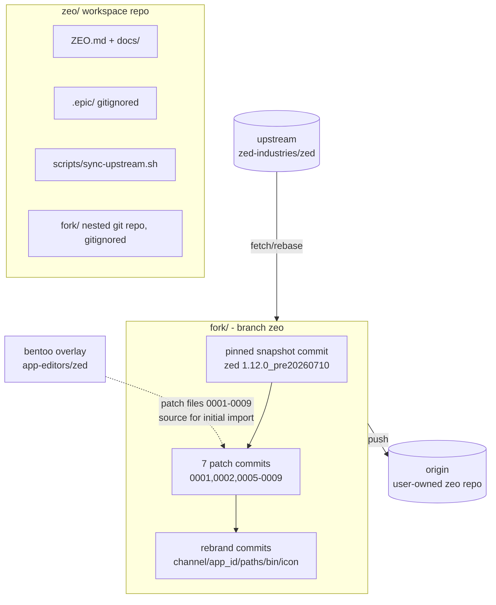
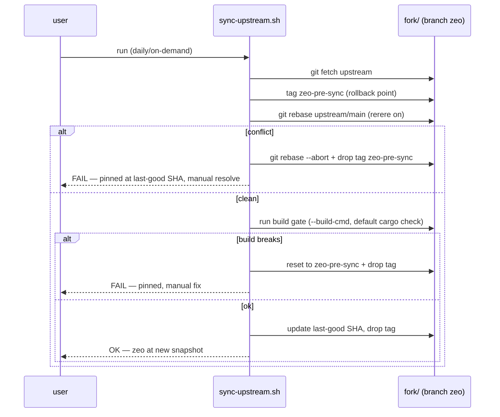

# Design - Zeo Fork Foundation

## Overview

Zeo is a standalone, installable fork of the Zed editor whose purpose is visual/UX
enhancement (native modern aesthetics + a Visual Extension API), openly identified as a
Zed fork. Story 001 establishes the foundation: the workspace layout, a real git fork
tracking upstream `main` (daily-snapshot cadence), minimal functional rebranding, the
incorporation of the 7 existing overlay patches as commits, a working release build, and
a documented/scripted upstream-sync workflow. Everything later (theme, chrome, Extension
API, ebuild) builds on top of this branch.

Research base: [`ZEO.md`](../../docs/ZEO.md) (full mapping of Zed extension/UI internals,
patch plan Phases 1-3, maintenance-cost analysis). It serves as the Architect research
artifact for this story.

## Confirmed Product Decisions (checklist outcomes)

| # | Decision | Rationale |
|---|---|---|
| D1 | **Shallow rebrand** — internal crate/package names stay `zed`; only the user-visible layer changes (display name "Zeo", desktop entry, icon, app-id, binary names) | Crate renames would conflict on every daily rebase |
| D2 | **Own release channel `zeo`** — new `ReleaseChannel` variant; channel-keyed code paths (app_id derivation, remote_server download, auto-update, URLs) handled explicitly | Current ebuild forces `nightly` precisely because unknown channels hard-fail |
| D3 | **Auto-updater neutralized** — Zeo never fetches/replaces itself with an official Zed binary from zed.dev | Unpatched updater on a rebranded fork is a self-destruct path |
| D4 | **Own state dirs** — `~/.config/zeo`, `~/.local/share/zeo`; no automatic settings migration in 001 (manual copy); must coexist with the overlay-installed Zed | Path separation prevents corrupting the existing Zed install |
| D5 | **Patches become commits** — the 7 overlay patches (0001, 0002, 0005-0009) are applied as regular commits on the `zeo` branch, all unconditional (incl. 0002, USE-gated in the ebuild today); overlay `.patch` files stop being source of truth for Zeo | Rebase-friendly; single history |
| D6 | **Sync policy** — daily-capable: fetch upstream → rebase `zeo` onto new snapshot; on conflict or build breakage, Zeo stays pinned to the last-good upstream SHA until manually resolved | Sync failure is non-blocking for users, blocking for the branch tip |
| D7 | **Remotes** — `fork/` is a full clone; `origin` = dedicated Zeo repository (user-owned, to be created), `upstream` = `zed-industries/zed`; never push to upstream | Existing workspace rule; branch needs a safe push target |
| D8 | **Build acceptance** — `cargo build --release` of the app + CLI packages on the Gentoo host; app launches under Wayland with Zeo branding (name, app_id, icon) and patched agent features work (0007 badge, 0008 attachments) as smoke test; no ebuild in 001 (story 007) | Makes "working build" falsifiable |
| D9 | **Executable names** — app binary and user-facing CLI are `zeo` (replaces the overlay's `zedit` convention); no PATH collision with the installed Zed | Side-by-side install is a hard requirement |
| D10 | **Placeholder icon** — new, visually distinct asset (512/1024 px, matching the `app-icon-*.png` resource layout); never reuse Zed's trademarked art; icon file name must match the app_id for Wayland icon resolution | Legal + compositor icon lookup |

## Architecture

Branch topology: `zeo` = pinned upstream snapshot + patch commits + rebrand commits.
Daily sync rebases the patch+rebrand commit stack onto the new upstream tip.

## Components & Interfaces

### 1. Workspace layout (repo `zeo/`, this directory)

- **Responsibility:** project home — docs, epic stories, sync script, future example
  extensions; NOT the fork source itself.
- **Contents:** `ZEO.md`, `docs/` (`SYNC.md`, `BUILD.md`, `REBRAND.md`, `UPSTREAM.md`),
  `scripts/sync-upstream.sh`, `tests/` (integration tests for the sync script),
  `.gitignore` (`.epic`, `fork/`), future `extensions/`.
- **Git:** initialized as its own repo (currently not one). `fork/` is a nested,
  independent repo and is gitignored here.

### 2. Fork clone & git topology (`fork/`)

- **Responsibility:** the actual Zeo source tree.
- **Interface:** branch `zeo`; remotes `origin` (user-owned) / `upstream` (zed-industries).
- **Setup:** full clone (enough history to rebase; `--filter=blob:none` acceptable,
  never `--depth 1` — rebase needs history). Start the branch **from the exact snapshot
  commit pinned by the current ebuild** (`zed-1.12.0_pre20260710-r1.ebuild`), apply
  patches there (guaranteed clean), then rebase forward to latest `main`.
- **Config:** `git config rerere.enabled true` in `fork/` (conflict resolutions replay
  on daily rebases).
- GOTCHA: patch series numbering has gaps (no 0003/0004) — apply in file order
  0001 → 0002 → 0005…0009 with `git am`; 0001 force-enables what 0002 needs, order matters.

### 3. Patch incorporation (7 commits)

- **Responsibility:** carry the ACP/agent-UI improvements into Zeo from day one (D5).
- **Source:** `/home/otaku/Projetos/git/bentoo/app-editors/zed/files/*.patch`.
- **Method:** `git am` (patches are `format-patch` output with authorship/messages).
  If any is a plain diff, fall back to `git apply` + authored commit.
- GOTCHA: 0002 is USE-flag-conditional in the ebuild; in Zeo it is unconditional —
  verify no feature-gate/cfg expected by 0002 is left off by default (0001 exists to
  force-enable it; confirm the pair is self-sufficient without ebuild intervention).

### 4. Rebrand commit set (D1, D2, D3, D4, D9, D10)

- **Responsibility:** minimal functional identity. One logical commit per concern, in a
  contiguous block at the top of the stack (easy to rebase/inspect):
  1. **Release channel:** add `Zeo` variant in `crates/release_channel` (exhaustive
     `match` arms are compiler-enforced — every channel-keyed site gets an explicit,
     conscious decision: display name "Zeo", app_id `dev.zeo.Zeo`, URL schemes `zeo://`).
     `crates/zed/RELEASE_CHANNEL` file content: `zeo`.
  2. **Auto-update:** disable for the `zeo` channel (compile-time arm returning
     "updates managed externally", equivalent to `ZED_UPDATE_EXPLANATION`); remote_server
     auto-download from zed.dev must not run for the `zeo` channel (no such artifact
     exists upstream) — explicit error or documented fallback to
     `ZED_REMOTE_SERVER_PATH`.
  3. **Paths:** `crates/paths` → `~/.config/zeo`, `~/.local/share/zeo` (and any cache
     dir) for the `zeo` channel/app.
  4. **Binaries:** app binary `zeo`, CLI user-facing `zeo` (mirror upstream's app/cli
     split — exact `Cargo.toml` `[[bin]]`/install mechanics verified at implementation;
     upstream currently ships app `zed` + `crates/cli` binary installed as the `zed`
     command — replicate that relationship under the name `zeo`).
  5. **Desktop entry + icon:** `.desktop` with `Name=Zeo`, `Icon=dev.zeo.Zeo`,
     `StartupWMClass`/app_id matching; new placeholder icon at 512/1024 px in the
     `app-icon-*.png` layout. Icon file name == app_id (Wayland icon resolution).
- **Extension registry compatibility:** untouched — Zeo keeps consuming Zed's extension
  registry (wire-compatible; D4 only separates local state paths).
- GOTCHA: grep for hardcoded `dev.zed.Zed*` and `zed.dev` beyond the channel matches —
  telemetry endpoints, crash reporter, and `zed://` URL-scheme registration must either
  follow the channel or be explicitly left as-is with a written rationale in REBRAND.md.

### 5. Upstream-sync workflow (`scripts/sync-upstream.sh` + `docs/SYNC.md`)

- **Responsibility:** D6 as an executable, documented procedure.
- **Interface (CLI):** `sync-upstream.sh [--repo <path>] [--to <ref>] [--build-cmd <cmd>]`
  — defaults: `fork/`, `upstream/main`, fast `cargo check` as gate (the real release
  build is exercised by the first real sync, not by the default gate).
- **Flow:** see sequence diagram. Non-zero exit + untouched last-good branch on any
  failure. Log of last-good SHA kept in `<repo>/.git/zeo-last-good` (single source of truth; contract pinned by the authored integration test).
- **Constraint (shell rules):** `set -euo pipefail`, quoted expansions, shellcheck-clean,
  array-based args.

### 6. Release build (D8)

- **Responsibility:** reproducible local release build on the Gentoo host.
- **Command:** `cargo build --release` for the app + CLI packages, `--frozen` against the
  upstream lockfile; reuse the environment workarounds encoded in the current ebuild
  (linker/env flags, vendored-git handling) — documented in `docs/BUILD.md`.
- **Out of scope:** packaging/installation system-wide (story 007).

## Error Handling Strategy

- **Patch apply failure (initial import):** `git am --abort` — the branch never holds a
  partially-applied patch (story R2.3).
- **Rebase conflict:** abort, stay pinned at last-good SHA (D6); rerere accumulates
  resolutions to shrink future conflicts.
- **Post-sync build breakage:** reset to `zeo-pre-sync` tag; branch tip never points at
  a non-building commit.
- **Unknown-channel code paths:** compiler-enforced via new enum variant (D2) — no
  runtime "unknown channel" state exists.
- **remote_server download for `zeo` channel:** explicit error message pointing to
  `ZED_REMOTE_SERVER_PATH` (no silent fallback to zed.dev artifacts).
- **PATH collision:** binaries named `zeo` (D9); side-by-side smoke check with installed
  Zed is part of acceptance.

## Security Considerations

- **No push to upstream** (D7): `upstream` remote configured fetch-only
  (`git remote set-url --push upstream DISABLED`).
- **Trademark:** no Zed art shipped under the Zeo name (D10); fork identity stated
  openly (README note in `origin` repo).
- **Self-update disabled** (D3): no binary replacement channel exists.
- **Supply chain:** build `--frozen` against upstream `Cargo.lock`; no new **third-party**
  dependencies in this story.
  > _Corrected during validation (2026-07-11, deviation **D-002**). The lockfile is NOT
  > byte-identical to upstream's: `Cargo.lock` +25 / `Cargo.toml` +2 across
  > `5f8a7413a3..zeo`. This is structural, not a supply-chain change — overlay patch 0002
  > adds the LOCAL path crate `crates/claude_code_ide`, and a new workspace member cannot
  > be absent from the lockfile and still build `--frozen`. The diff adds exactly one
  > `[[package]]` stanza, with no `source =` line (not from crates.io); its 17 deps were
  > already in the base lockfile. Zero third-party crates added, zero checksums changed._

## Testing Strategy

- **Unit tests:** none new — foundation story is structural; upstream test suite must
  still compile/pass for touched crates (`release_channel`, `paths`, `auto_update`).
- **Integration tests:** scripted checks — binary is named `zeo`; `--version`/channel
  string reports Zeo; config dir resolves to `~/.config/zeo`; desktop file/app_id/icon
  name consistency; sync script failure paths (simulated conflict → pinned).
- **E2E tests:** manual smoke under Wayland — app launches with Zeo name/icon/app_id,
  agent panel patched features work (0007 manual-mode badge, 0008 clickable
  attachments), coexists with installed Zed. (tool: `none`)

## Tooling Decisions

- E2E tool: `none` — browser tooling (playwright/chrome-devtools) not applicable to a
  native GPUI desktop app; validation via cargo + scripted checks + manual smoke
- Frontend aid: `none` (GPUI, not web)
- Recommendation surfaced: no — favorites present but inapplicable

## Integration Points

- **bentoo overlay (`app-editors/zed`):** remains untouched and independent; its
  `.patch` files seed the initial commits (D5) but diverge afterwards. Story 007 adds
  `app-editors/zeo`.
- **claude-agent-fork workspace:** origin of the agent/ACP patches; future changes there
  land in Zeo via normal commits on `zeo` (cherry-pick or re-port), no longer via
  overlay patch files.
- **Future stories:** 002 (theme/design tokens) and 004-005 (Visual Extension API per
  `ZEO.md` §5) stack their commits on the same `zeo` branch using the same sync policy.
