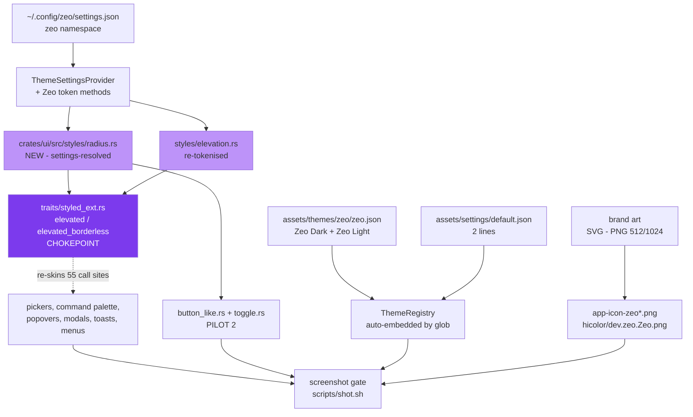

# Design - Zeo Visual Identity

## Overview

Story 002 delivers Zeo's first "wow": an elegant, sophisticated editor on open. It has
three halves, in increasing rebase cost: a **bundled Zeo theme** (data — zero code), a
**design-token layer** patched into the core (code — centralised so that stories 003 and
006 have something to consume), and the **final brand art** replacing 001's placeholder.

Research produced three findings that drive every decision below, all verified in the
working tree:

1. **Zeo's accent is currently Zed's `info` colour.** `text.accent` and `info` are
   byte-identical in both modes (`fork/assets/themes/one/one.json:34,128` dark;
   `:448,540` light). The accent has no independent identity. Two hexes fix it — the
   highest identity-per-byte change available.
2. **Zed's elevation is broken, not restrained.** `elevated_surface.background` ==
   `surface.background` (`one.json:16-17` dark, `:430-431` light) — an "elevated" surface
   gets **no background step at all**, leaving a black drop shadow as its only cue, which
   a dark canvas swallows. This is the mechanical cause of the flat look.
3. **The whole app's elevated chrome funnels through six lines of code.**
   `fork/crates/ui/src/traits/styled_ext.rs:6-18` (`elevated` / `elevated_borderless`)
   applies `.rounded_lg().border_1().shadow(...)` and backs `elevation_1/2/3`, used at
   **55 call sites across 45 files** — pickers, command palette, popovers, modals,
   context menus, toasts. Its upstream churn over six months is **zero**.

The story therefore converts a small, cold, high-leverage patch set rather than a broad
one, and proves the token layer against two pilots. The chrome containers (title bar, tab
bar, dock) are explicitly left to story 003 — they carry the repo's hottest churn and, per
the research, currently have **no radius at all** to re-point.

## Confirmed Product Decisions (checklist outcomes)

| # | Decision | Rationale |
|---|---|---|
| **D1** | Tokens are **settings-resolved** (`fn(cx: &App) -> Pixels`), never compile-time constants | Story 006 requires knobs mapping 1:1 to tokens with live reload. Constants would force a refactor of every call site 003 will have spread by then. The precedent exists: `DynamicSpacing::px(cx)` (`crates/ui_macros/src/dynamic_spacing.rs:159-162`) |
| **D2** | The GPUI radius constants (`crates/gpui_macros/src/styles.rs:1228-1276`) are **rejected as the substrate** | Editing them rescales all 331 call sites in one ~10-line hunk — tempting, but they are **compile-time**, so they can never become a user setting (kills D1/006), and they silently restyle gpui examples and editor internals. Recorded as a documented fallback only, if the token rollout stalls |
| **D3** | The radius token lives in a **new file**, `crates/ui/src/styles/radius.rs`, plus 2 lines in `styles.rs` | Append-only. Both files' 6-month churn is **0**. Cheapest possible insertion point |
| **D4** | The Zeo radius scale **reuses GPUI's existing lattice**: 0 / 2 / 4 / 6 / 8 / 12 / 16 / full | These are already GPUI's values (`gpui_macros/src/styles.rs:1228-1275`, a verbatim Tailwind v4 port). Zeo invents **no new numbers**; the change is *semantic* — which role gets which step |
| **D5** | Nested-radius rule: **`inner = outer − padding`** | Verified closed over the D4 lattice and the spacing scale (12−8=4, 8−4=4, 8−6=2, 16−4=12 — all on-scale). Any change to either scale must re-verify closure |
| **D6** | The **spacing scale is unchanged**; only its *rhythm of use* changes | `DynamicSpacing` (`crates/ui/src/styles/spacing.rs:29-44`) is already good and density-aware, and its fine low end (1,2,3,4,6) is exactly what enables editor density. Rhythm: 8 inside a group, 16 between groups, 32 between sections |
| **D7** | Elevation is **re-modelled**: separate surfaces by *background step + hairline* first; shadow only for `e2`/`e3`; add an **inset rim light** | Fixes the verified `elevated == surface` bug. Matches the convergent practice of Linear/Geist/Raycast. GPUI supports inset shadows (`crates/gpui/src/style.rs:355`), so the rim is free |
| **D8** | **Pilot 1** — the chokepoint: `styled_ext.rs::elevated{,_borderless}` + `elevation.rs::shadow()` | 3 hunks, churn 0 and 3, re-skinning 55 call sites across 45 files **without touching a single call site** |
| **D9** | **Pilot 2** — `button_like.rs` + `toggle.rs` (churn 3 each) | Covers every button and toggle in the app. Together with D8 this is nearly everything the user sees, at minimum rebase cost |
| **D10** | Theme ships as `assets/themes/zeo/zeo.json`, family **Zeo**, variants **Zeo Dark** + **Zeo Light** | Themes are embedded by *directory glob* (`crates/assets/src/assets.rs:7-13`) and discovered by listing (`theme_settings.rs:218-241`) ⇒ **zero code, zero rebase surface** |
| **D11** | The default is flipped by **2 lines** in `assets/settings/default.json:11-12` | The file has 154 commits in 6 months, but the `theme` block (lines 9-13) has **zero** — file churn is not line churn. The 2-line hunk is safe |
| **D12** | **No channel-conditional default** | The Zeo binary is always channel `zeo` (`crates/release_channel/src/lib.rs:146,217`). A channel check would be dead code |
| **D13** | The accent is **decoupled from `info`** and set to **Amethyst**: `#BD93F9` (dark) / `#7C3AED` (light) | See "Accent" below. Gold — the literal Zeo Crystal colour — is **doubly disqualified**: it is the most derivative choice *and* it collides with `warning`/`git-modified` (hue 41-48°) |
| **D14** | Syntax palette is **derived from One Dark and harmonised** with the Zeo accent, not authored from scratch | A ground-up syntax palette is a project in itself and is where themes die. Derivation gives coherent identity at a fraction of the risk; code stays legible and familiar from minute one |
| **D15** | **Fonts unchanged.** Weight-500 tokens are **forbidden**; hierarchy comes from 400/600 + size + colour | The bundle ships only Regular(400) and SemiBold(600) for IBM Plex Sans — **no Medium** (`assets/fonts/ibm-plex-sans/`). `FontWeight` is an `f32` so `MEDIUM` *compiles*, but it is **unbacked** by any font file. And GPUI exposes **no variable-font axis API** (no `wght`/`opsz` in `crates/gpui/src/text_system.rs`), so the Inter-Variable swap is not a reliable lever |
| **D16** | **Motion tokens are out of scope** → story 003 (recommended values recorded below for it to inherit) | GPUI has no CSS transition system: `.hover()` applies its style *instantly* (`crates/gpui/src/elements/div.rs:778,3170`). 002 has no consumer for a motion token, so shipping one would be an orphan |
| **D17** | Five design ideas are **killed by GPUI and recorded as killed** — tracking, blur, >2-stop gradients, container transforms, per-side border colours | Written into the spec so they are never proposed in review. See "GPUI constraints" |
| **D18** | Trademark rule, **symmetric to 001's rule for Zed's mark**: the art may be *evocative* (faceted crystal, gemstone, prism) but **never derivative** of the Power Rangers franchise (a Hasbro property) | 001 forbade deriving from Zed's trademarked artwork (`.epic/stories/001-*/story.md:73`). Zeo is a publicly downloadable product, so the same rule must be written against Hasbro — no franchise logotype, colourway, character iconography, or lightning-bolt-Z lockup |
| **D19** | The brand art is derived **from the accent**, not the reverse | 001's placeholder is indigo→teal (`#291B73`→`#35AFC8`, measured); it is a *placeholder*, not the identity's source of truth, and it does not harmonise with any viable accent |
| **D20** | The design gate is made **falsifiable** before the art exists: contrast floor, token coverage, fixed screenshot fixture, parity | "The approved spec is the arbiter" is circular — the spec is approved by the very act that would judge it. See "Testing Strategy" |
| **D21** | Radius is **density-invariant** but **`ui_font_size`-proportional** | Density governs how much *air* sits between elements, not the *shape* of an element. A tighter layout must not round its buttons harder: a 6px button radius stays 6px at Compact and Comfortable alike. It does scale with `ui_font_size`, because radius must stay in proportion to the control it rounds. Unlike `DynamicSpacing`, the radius scale therefore has **no density triple** |
| **D22** | `Full` is a **fixed sentinel** (`px(9999)`), exempt from the `ui_font_size` scaling every other step obeys | `9999 × (ui_font_size / 16)` is meaningless. `Full` means "a pill" — it is a shape declaration, not a measurement |
| **D23** | The Zeo settings namespace ships **one concrete knob**: `zeo.radius_scale: f32` (default `1.0`), a multiplier over the radius scale, **clamped to 0.5–2.0** | An "empty defaults" namespace is untestable and unfalsifiable — and would be exactly the orphan-code failure this story's Quality Gate forbids. One real knob makes the settings hook provable, and gives story 006 its first working token→knob mapping to build on. The clamp keeps `0` (everything square) and `1000` (a rendering pathology) out of a user-editable JSON file — story 006 inherits a validated knob, not a raw `f32` |
| **D24** | **The chokepoint ignores the elevation ladder entirely — a third defect, found while authoring the tests.** `styled_ext.rs:7,15` hard-code `elevated_surface_background` and use the `ElevationIndex` **only for the shadow**. `ElevationIndex::bg()` is called from nowhere in `crates/ui` — it is dead code. So `elevation_1`, `elevation_2` and `elevation_3` all paint the **same** background. Fix: the helpers must call `index.bg(cx)` | This is why the other two defects were not sufficient. Fixing the palette (D7/finding 2) changes nothing while the helper never asks the enum which step it is on. R2.1's mechanism half is unreachable without this |
| **D25** | Add a **new theme colour token — `modal_surface_background`** — and point `ElevationIndex::ModalSurface` at it | `ElevatedSurface` and `ModalSurface` both resolve to `elevated_surface_background` (`elevation.rs:89-90`), so even after D24 the `e2`/`e3` step promised by D7 cannot exist: there is no colour to step *to*. Cost: 2 more upstream files — `theme/src/styles/colors.rs` (churn 6) and `settings_content/src/theme.rs` (churn 12), both under the p90 of 26. Rejected alternative: deriving `e3` from `e2` by a fixed lightening factor in Rust — cheaper, but it takes the modal's colour out of the theme's hands and breaks the "knobs map 1:1 to tokens" principle story 006 rests on |

## Visual Language

> This section is the **arbiter of the design gate**. It is delivered as a navigable HTML
> token gallery (published as an Artifact) showing every scale in light and dark. If a
> later change contradicts a statement here, the statement — not the change — is wrong
> until amended.

### Principles

Each is falsifiable and maps to a named token. Framed as "modern means X, not Y".

1. **Elevation is a surface ladder plus a hairline — not a drop shadow.** Separate
   surfaces with a 2-3 point luminance step and a 1px low-contrast border; reserve
   shadows for things that genuinely float (popover, modal). Zed already half-agrees:
   `ElevationIndex::Surface` and `::EditorSurface` return `vec![]`
   (`crates/ui/src/styles/elevation.rs:46-47`) — deliberately no shadow. The defect is
   that the *background step* is missing too (finding 2).
2. **Shadow alpha ≤ 9%, offset ≤ 7px.** Measured peaks in well-regarded products:
   Cursor 0.8-2%, Geist 2-6%, Linear 6-9%, VS Code 8-15%, **Tailwind defaults 10-25%**.
   This bites directly: **GPUI's `shadow_sm/md/lg/xl` are a verbatim Tailwind port**
   (`crates/gpui_macros/src/styles.rs:390-488`) — GPUI ships the *dated* baseline as its
   convenience API. Zed's own `ElevationIndex` wisely ignores it (peak 12%). **Never
   reach for `.shadow_lg()`.**
3. **One accent; everything else is semantic.** One brand hue, plus strictly semantic
   status colours. Convergent practice across Linear, Geist and Raycast — presented as an
   observed convention, not a law.
4. **The accent must be its own hue.** Today Zeo's is literally the `info` colour
   (finding 1). Splitting them is the cheapest, highest-signal identity move available.
5. **Radius is a family per role, never one value everywhere, and never mixed sharp and
   round in one view.** Controls hold at 6px; containers step up (8 → 12 → 16).
   Counter-rule: **do not over-round** — a 10px button in a code editor reads "web app in
   a window".
6. **Nested radius: `inner = outer − padding`** (D5), so concentric arcs share a centre.
7. **Never default to `ease_in_out`.** That curve is Material Design 3's own
   *`easing-legacy`* — Google's explicitly deprecated 2014 curve — and it is
   simultaneously Tailwind's default. Entrances decelerate (ease-out). *(Consumed by 003;
   recorded here.)*
8. **Interactions are instant; only entrances animate, and for under 300ms.** GPUI
   *forces* instant hover (D16) — the constraint happens to be current best practice.
9. **Dense-UI type lives at 11-15px with line-height ~1.4, and hierarchy comes from
   weight and colour, not size.** Nobody in the reference set uses 700+ for UI. 16px is a
   marketing size, not a dense-UI size.
10. **Borders are translucent, often sub-pixel** — an `Hsla` with alpha, so one token
    layers correctly on any surface, rather than an opaque grey that only works on one.
11. **"Flat" does not mean "no depth" — it means depth at 1px scale.** Modern depth is a
    hairline of light on the top edge + a hairline ring + a wide, very faint drop. On a
    dark background a black drop shadow is nearly invisible; **the rim light is what
    actually sells elevation.**
12. **Focus rings use a spread shadow, not an outline**, so they follow the corner
    radius. GPUI has no ring API, but a zero-blur, positive-spread `BoxShadow`
    reproduces it exactly and respects `corner_radii`.

### Radius scale (D4)

Every value maps 1:1 to an existing GPUI helper — Zeo adds the *semantics*, not the
numbers. The token resolves through `cx` (D1); the helper column shows the equivalent
compile-time call for reference.

| Token | px | GPUI equivalent | Role |
|---|---|---|---|
| `none` | 0 | `.rounded_none()` | editor surface, gutter, full-bleed |
| `xs` | 2 | `.rounded_xs()` | inline chips, scrollbar thumb, list-row hover |
| `sm` | 4 | `.rounded_sm()` | tags, badges, checkboxes |
| **`md`** | **6** | `.rounded_md()` | **buttons, inputs, tabs, list items** — the workhorse |
| `lg` | 8 | `.rounded_lg()` | cards, panels, popovers, hover cards |
| `xl` | 12 | `.rounded_xl()` | modals, command palette, app frame |
| `2xl` | 16 | `.rounded_2xl()` | window corners, fullscreen overlays |
| `full` | 9999 | `.rounded_full()` | avatars, pills, toggles |

**What actually changes versus Zed today.** Zed's usage is bimodal — `rounded_sm`(4) ×30
and `rounded_md`(6) ×30, with `rounded_lg`(8) only ×4 and `rounded_xl`(12) only ×1. Zeo's
move is **promoting containers up a step** (panels/popovers 4→8, modals →12) while holding
controls at 6.

**Nested-radius closure, verified:**

| Case | outer | padding | inner | on scale? |
|---|---|---|---|---|
| modal / command palette | 12 | 8 | 4 | ✓ |
| popover, card | 8 | 4 | 4 | ✓ |
| panel | 8 | 6 | 2 | ✓ |
| window → content | 16 | 4 | 12 | ✓ |

### Spacing (D6)

Scale unchanged. `DynamicSpacing` variants are `(compact, default, comfortable)` triples
expressed in **rems** (÷16), so they already scale with `ui_font_size`.

| Rhythm | Token | px (default density) |
|---|---|---|
| inside a group | `Base08` | 8 |
| between groups | `Base16` | 16 |
| between sections | `Base32` | 32 |
| panel / container padding | `Base08`–`Base12` | 8-12 |
| list-row padding | `Base04`–`Base06` vertical, `Base08` horizontal | 4-6 / 8 |

### Elevation (D7)

The current ladder, measured from the verified hexes, showing the dead step:

| | Zed One Dark | luminance | step |
|---|---|---|---|
| canvas | `#282c33` | 17.8% | — |
| surface | `#2e343e` | 21.2% | +3.3 |
| **elevated surface** | `#2f343e` | 21.4% | **+0.2 ← dead** |

Proposed model — four levels, separation by step and hairline **first**:

| Level | Role | bg step (dark) | Border | Shadow | Rim (inset) |
|---|---|---|---|---|---|
| `e0` | editor / canvas | base | none | none | none |
| `e1` | panel, sidebar, status bar | +2-3 L | 1px hairline | **none** | none |
| `e2` | popover, dropdown, hover card | +4-5 L | 1px hairline | `0 2px 3px /12%` + `0 1px 0 /6%` | `inset 0 1px 0 white/5%` |
| `e3` | modal, command palette | +6-8 L | 1px border | Zed's existing 4-layer `ModalSurface` stack | `inset 0 1px 0 white/6%` |

The `e2`/`e3` shadow stacks are **Zed's own existing values**
(`crates/ui/src/styles/elevation.rs:49-77`, peak alpha 12%) — kept, not replaced. The
**rim light is the new part**, and it is what makes elevation visible on a dark canvas
(principle 11).

### Typography (D15)

| Token | Size | Line-height | Weight | Use |
|---|---|---|---|---|
| `text.xs` | 10px | 1.4 | 400 | badges, counts, gutter annotations |
| `text.sm` | 12px | 1.4 | 400 | status bar, breadcrumbs, secondary |
| **`text.base`** | **14px** | 1.45 | 400 | **default UI** |
| `text.md` | 14px | 1.5 | **600** | emphasis, primary labels |
| `text.lg` | 16px | 1.5 | 600 | section headings |
| `heading.sm` / `.md` | 18 / 20px | 1.4 / 1.3 | 600 | panel / modal titles |
| `editor` | 15px | 1.618 | 400 | buffer — Zed's default, kept |

**Hard constraint:** only 400 and 600 exist in the bundle. A weight-500 token would be
unbacked and silently synthesised. Hierarchy is carried by **400/600 + size + colour**
(`text` / `text_muted` / `text_placeholder`).

### Accent (D13)

An accent must clear WCAG AA (≥4.5:1) on the editor surface in **both** modes and stay
clear of the hue bands the editor already needs. Occupied bands in Zed One:
error/deleted **357°/7°**, warning/modified **41°/48°**, success/created **90°/109°**,
info **210°/228°**.

**Selected — Amethyst (crystal violet):**

| | Hex | Hue | vs editor bg | vs chrome bg | min hue separation |
|---|---|---|---|---|---|
| dark | **`#BD93F9`** | 265° | **5.81:1** | 4.25:1 | 54° |
| light | **`#7C3AED`** | 262° | **5.46:1** | 4.16:1 | 35° |

*Signals* gem, prism, calm premium — the most literal read of "crystal" with zero
franchise referent. *Risk:* the light variant's 35° separation from `info` is tight;
mitigate by desaturating `info` in the Zeo light theme.

**Considered and rejected:** *Prism Teal* (`#4FD8C4` / `#0F766E`) — only 39° from `info`
in dark, and the natural light variant `#0D9488` **fails AA at 3.59:1**; that fragility is
disqualifying. *Crystal Magenta* (`#EE87D4` / `#B31FA0`) — best hue separation (42°/60°)
but reads consumer rather than tool. Both are recorded in the gallery as the runners-up.

**Rule that falls out of the maths:** the accent **must ship as two hexes, one per mode**.
A single hex cannot serve both — Linear's own `#5E6AD2` scores 2.98:1 on Zed's dark editor
background and would fail outright.

### GPUI constraints — ideas that are dead on arrival (D17)

GPUI's renderer is **eight primitives** (`crates/gpui/src/scene.rs:202`). If a token does
not decompose into them, it cannot render. These are recorded so they are never proposed:

| Killed | Why | Citation |
|---|---|---|
| **Letter-spacing / tracking tokens** | `TextStyle` has no such field, at all | `crates/gpui/src/style.rs:434-474` |
| **Blur — backdrop or element (glassmorphism)** | Architecturally impossible: shadow "blur" is an analytic convolution of a *shape*, never a sample of underlying content. No offscreen pass exists | — |
| **3+ stop, radial, conic or mesh gradients** | Hard-capped at two stops | `Background.colors: [LinearColorStop; 2]`, `color.rs:784,865` |
| **Transforms on containers (scale-on-press, dialog zoom)** | `TransformationMatrix` exists on only 2 sprite primitives — not on `Quad` | `scene.rs:684,703` |
| **Per-side border colours (bevels)** | `Quad.border_color` is singular. **Use an inset shadow for the top rim instead** — which works | `scene.rs:507` |
| **Rounded clipping of children** | `ContentMask` is a plain rectangle; a child overflowing a rounded parent pokes out of the corners. **Every child must round itself** | `window.rs:1790-1793` |

**Damage assessment, honestly.** Tracking is near-free to lose: Geist uses **zero
tracking on all UI text**, and Linear's −0.011em at 15px is **−0.16px** — sub-pixel. What
is genuinely foreclosed is *display* type, which an editor barely has. Blur is a hard no
and glassmorphism must not appear in any mock.

**The finding that should calibrate ambition:** Hummingbird — the best-looking GPUI app in
the wild — uses **0 gradients, 0 box-shadows, 0 custom paths, 1 animation**, against 67
SVGs, 32 opacities and 29 rounded corners. Its quality is *entirely* typographic
hierarchy, generous spacing, a restrained palette and alignment. **GPUI's ceiling is
"beautifully flat", and that ceiling is high enough.** The risk to Zeo is not GPUI's
limits — it is under-using restraint.

### Motion — recorded for story 003 (D16)

Not shipped in 002 (no consumer). Recorded so 003 inherits a decision, not a blank:

| Token | Duration | Easing | Applies to |
|---|---|---|---|
| `instant` | **0ms** | — | hover, press, selection — **forced by GPUI, and correct** |
| `fast` | 100ms | `ease_out_cubic` (custom closure) | tooltip, small popover |
| `base` | 150ms | `ease_out_quint` (GPUI built-in) | dropdown, panel reveal |
| `slow` | **250ms** | `ease_out_cubic` | modal, command palette — *tighten Zed's current 300* |

GPUI's `ease_out_quint` (`1 − (1−t)⁵`) is exactly Linear's `--ease-out-quint`. Custom
curves are ~6 lines: `with_easing` accepts any `Fn(f32) -> f32`
(`crates/gpui/src/elements/animation.rs:222-258`).

## Architecture



The **settings → token → call site** spine is what makes story 006 a trivial addition
rather than a refactor: a new knob adds a settings field and a resolver arm, and every
site that already reads the token picks it up live.

## Components & Interfaces

### 1. Zeo token module (`crates/ui/src/styles/radius.rs` — NEW)

- **Responsibility:** own the radius scale (D4) and resolve it against settings (D1).
- **Interface:** an enum with `fn px(&self, cx: &App) -> Pixels` and
  `fn rems(&self, cx: &App) -> Rems`. Call sites use `.rounded(ZeoRadius::Md.px(cx))` —
  the argument form, which exists (`crates/ui/src/components/avatar.rs:224` proves it).
  **No per-corner token surface is needed:** GPUI's `rounded_tl/tr/br/bl` already take a
  `Pixels` argument (`gpui_macros/src/styles.rs:1206`), so `button_like.rs` can write
  `.rounded_tl(ZeoRadius::Md.px(cx))` against the plain token.
- **Constraint:** append-only. Registration is 2 lines in `styles.rs` (`mod radius;` +
  `pub use radius::*;`) — churn 0.
- **Constraint (D21):** the scale is **density-invariant** — there is no density triple,
  unlike `DynamicSpacing`. It *is* `ui_font_size`-proportional.
- **Constraint (D22):** `Full` is a fixed sentinel and is **exempt** from that scaling.
- **Constraint (D23):** the resolved value is multiplied by the `zeo.radius_scale` setting
  (default `1.0`) — this is what makes the token settings-resolved rather than merely
  context-passed, and it is what the 2.1 test asserts.
- **GOTCHA: `DynamicSpacing::px(cx)` is `ui_font_size × ratio`, NOT `16 × ratio`**
  (`crates/ui_macros/src/dynamic_spacing.rs:159-162`). A radius token that hard-codes 16
  will silently drift away from spacing the moment a user changes `ui_font_size`. Mirror
  the same formula, or return `rems` and let GPUI's `rem_size` do the scaling.
- **GOTCHA: the nested-radius closure (D5) is closure over *two* scales, not one.**
  `outer − padding` only lands on the radius scale if the padding came from
  `DynamicSpacing`. A test that hard-codes the padding literals pins nothing — it must
  compute against the real `DynamicSpacing` values, or D5's own rule ("any change to
  either scale must re-verify closure") is unenforceable.
- **GOTCHA: do not build on `UiDensity::spacing_ratio()`** (`crates/theme/src/ui_density.rs:37`).
  It *looks* like the density hook but is unused by `DynamicSpacing` (the macro does its
  own arithmetic) and carries an upstream `TODO: Standardize usage throughout the app or
  remove`. Building on it will silently do nothing — and it may be deleted upstream. Read
  density via `theme::theme_settings(cx).ui_density(cx)`.

### 2. Settings hook (`crates/theme/src/theme_settings_provider.rs` + `theme_settings.rs`)

- **Responsibility:** expose the Zeo token values to any `&App`.
- **Interface:** extend the `ThemeSettingsProvider` trait (`:9-24`) with the Zeo token
  accessors; implement on `ThemeSettingsProviderImpl` (`theme_settings.rs:43-65`,
  registered at `:75`).
- **Constraint:** churn is **1** on the trait file and **9** on the impl — both cold
  enough to patch idiomatically. This was preferred over a new crate with a second global,
  which would have been append-only but required a line in `crates/zed/src/main.rs`
  (churn **90**) and duplicated a mechanism that already exists.
- **Free win:** live reload needs no work. `theme_settings.rs:104-161` already observes
  `SettingsStore` and calls `cx.refresh_windows()`. **This is the hook story 006 hangs
  on** — creating the empty `zeo` settings namespace now is nearly free and de-risks 006
  substantially.

### 3. Elevation re-tokenisation (`crates/ui/src/styles/elevation.rs`)

- **Responsibility:** implement the D7 model — background step, hairline, rim, shadow.
- **Interface:** `ElevationIndex::{shadow, bg}` keep their signatures; a `rim()` accessor
  is added.
- **Constraint:** churn 3. This is the one place the append-only preference is knowingly
  traded for an in-place edit — the alternative (a parallel elevation system) would have
  left two competing models.
- **GOTCHA: `ElevationIndex::Surface` and `::EditorSurface` return `vec![]`
  deliberately** (`:46-47`) — that is upstream design intent, not an oversight. The fix
  for flatness is the **background step and rim**, not adding a shadow there.

### 4. The chokepoint (`crates/ui/src/traits/styled_ext.rs:6-18`) — Pilot 1

- **Responsibility:** apply background step + radius + border + shadow + rim to every
  elevated surface.
- **Interface:** `elevated<E: Styled>(this, cx, index)` and `elevated_borderless(...)`,
  unchanged signatures; only their bodies change.
- **Constraint:** churn **0**. Three hunks total (these two functions + `shadow()`).
- **GOTCHA — the third defect (D24). The helpers ignore the elevation ladder.** Verified:
  ```rust
  fn elevated<E: Styled>(this: E, cx: &App, index: ElevationIndex) -> E {
      this.bg(cx.theme().colors().elevated_surface_background)  // <- hard-coded, not index.bg(cx)
          .rounded_lg().border_1()
          .border_color(cx.theme().colors().border_variant)
          .shadow(index.shadow(cx))                            // <- index used ONLY here
  }
  ```
  `elevation_1` (Surface), `elevation_2` and `elevation_3` therefore all paint the **same**
  background, and `ElevationIndex::bg()` is called from **nowhere** in `crates/ui`. The
  fix is to call `index.bg(cx)`. **Without it, fixing the palette accomplishes nothing** —
  the helper never asks the enum which step it is on. This defect is why findings 1 and 2
  were not, on their own, enough.

### 4b. Modal surface colour (`crates/theme/src/styles/colors.rs` + the theme schema) — D25

- **Responsibility:** give `e3` a colour to step *to*.
- **Interface:** a new `modal_surface_background: Hsla` field on `ThemeColors`, exposed in
  the theme JSON schema; `ElevationIndex::ModalSurface` resolves to it.
- **Constraint:** `ElevatedSurface` and `ModalSurface` currently **both** return
  `elevated_surface_background` (`elevation.rs:89-90`), so the four-level ladder of D7 is
  unrepresentable until this exists. Adds 2 upstream files to the patch set:
  `colors.rs` (churn 6) and `settings_content/src/theme.rs` (churn 12) — both below the
  p90 of 26, and this is a knowing, recorded trade.
- **GOTCHA:** `ThemeColors` is `#[derive(Refineable, ...)]` — adding a field means the
  refinement/schema derives regenerate. Every existing theme leaves it unset, so the
  fallback must be sane (fall back to `elevated_surface_background`, preserving today's
  appearance for every non-Zeo theme). **Do not let existing themes render a black modal.**
- **GOTCHA: elevated surfaces do NOT set their radius at the call site.** Grepping
  `.rounded_` in `crates/picker`, `crates/command_palette` and `crates/notifications`
  returns **zero hits** and will lead an implementer to conclude those surfaces have no
  radius. They inherit it from `elevated()`. **Patch the two helpers, never the 45 call
  sites.**

### 5. Control pilots (`components/button/button_like.rs`, `components/toggle.rs`) — Pilot 2

- **Responsibility:** prove the token on directly-styled components.
- **Interface:** replace `.rounded_*()` literals with `.rounded(ZeoRadius::_.px(cx))`.
- **Constraint:** churn 3 each. `button_like.rs:753-756` uses the per-corner form
  (`rounded_tl/tr/br/bl_sm`) — GPUI supports per-corner radius
  (`gpui_macros/src/styles.rs:1161-1226`), so the token must expose it too.

### 6. Zeo theme family (`assets/themes/zeo/zeo.json` — NEW)

- **Responsibility:** carry **colour only** — the Zeo palette, accent (D13), and the
  harmonised syntax (D14), in Dark and Light.
- **Interface:** `ThemeFamilyContent` JSON; auto-discovered, no code.
- **Constraint:** the theme JSON **cannot express geometry** — verified:
  `ThemeStyleContent` (`crates/settings_content/src/theme.rs:473-491`) is
  colors/syntax/players/accents plus `background.appearance`, and nothing else. Any
  attempt to add `radius`/`spacing` to it means patching the schema struct, its
  `MergeFrom`/`JsonSchema` derives, `refine_theme()` and `ThemeStyles` — four hot upstream
  files. **Geometry goes in the token module; the theme carries colour.**
- **GOTCHA: the theme is keyed by the `name` field inside the JSON, not the filename.** If
  the string in `default.json` does not match it **exactly**, the app **silently falls
  back to One Dark** — and the error is only logged, after extensions load
  (`theme_settings.rs:171-181`). This is the single most likely way to ship a Zeo build
  that looks like Zed and not notice.
- **Must fix in the palette:** `elevated_surface.background` must differ from
  `surface.background` (finding 2), and `text.accent` must differ from `info` (finding 1).
  Both are currently identical in both modes.

### 7. Default theme flip (`assets/settings/default.json:11-12`)

- **Interface:** `"light": "Zeo Light"`, `"dark": "Zeo Dark"`. `"mode": "system"` kept.
- **Constraint:** 2 lines. File churn 154/6mo but **line churn 0** (D11).
- **Decision recorded:** `DEFAULT_LIGHT_THEME`/`DEFAULT_DARK_THEME`
  (`crates/settings_content/src/theme.rs:289-290`) and the `zed_default_themes()` fallback
  family are **left alone**. They only apply when the registry has no themes at all — a
  pathological case — and the file's churn (12) buys nothing.

### 8. Brand art

- **Responsibility:** replace 001's placeholder with final art derived from the accent
  (D19).
- **Interface:** an in-place asset swap — same filenames, same sizes ⇒ **zero rebase
  surface**: `crates/zed/resources/app-icon-zeo.png` (512),
  `app-icon-zeo@2x.png` (1024), and
  `crates/zed/resources/zeo/hicolor/{512x512,1024x1024}/apps/dev.zeo.Zeo.png`.
- **Method:** `nanobanana` explores directions → the chosen one is redrawn as a clean
  geometric **SVG** (committed as source) → exported to PNG.
- **Measured baseline of the placeholder:** mean luminance **0.85**, contrast **14.5:1**
  against a KDE dark panel, dominant colours `#291B73` → `#35AFC8`. **The defect is
  therefore not contrast — it is form.** 001 recorded it as "reads flat"; the objective
  problem is a flat two-tone "Z" with no depth, in a hue family that does not harmonise
  with any viable accent.
- **GOTCHA (three independent silent-failure modes — all three must be in the task):**
  1. The window icon is picked at **build time** by `build.rs` from the `RELEASE_CHANNEL`
     **environment variable**, which is a *different* mechanism from the
     `crates/zed/RELEASE_CHANNEL` **file** that drives the runtime enum
     (`docs/BUILD.md:37`). Rebuilding without `RELEASE_CHANNEL=zeo` yields the **dev
     icon**, and the validator concludes "the art didn't apply".
  2. KDE caches: the icon does not appear until `kbuildsycoca6` **and**
     `gtk-update-icon-cache` are run (`docs/REBRAND.md:85-89`).
  3. `hicolor/index.theme` declares sizes only up to `512x512/apps` — **the 1024px asset
     is a master and is never resolved by icon-theme lookup** (`docs/REBRAND.md:87-89`).

  Validation must therefore be "the *installed* icon's checksum changed **and** the
  running window shows it after a cache rebuild" — never "I replaced the PNG".

### 9. Screenshot harness (`scripts/shot.sh` — NEW, workspace repo)

- **Responsibility:** produce comparable before/after pairs.
- **Interface:** launch Zeo with a **clean, fixed profile**; fixed window size; fixed
  fixture (same file open, same panels); capture via `grim`; emit to
  `.epic/stories/002-visual-identity/shots/{before,after}/<surface>-{dark,light}.png`.
- **Constraint:** **`slurp` is absent** on this host, so `grim` cannot take an interactive
  region. Capture is full-output (or per-window via `spectacle`) and cropped post-hoc with
  `magick` against **fixed** coordinates. This makes the fixed fixture not a nicety but a
  **hard prerequisite** — without it, before/after pairs are not diffable and the gate
  degrades into vibes.
- Shell rules apply (`set -euo pipefail`, quoted expansions, arrays).
- Story 003 reuses this script per component — which is why it is scripted rather than
  manual.

## Error Handling Strategy

| Failure | Handling |
|---|---|
| Theme name mismatch in `default.json` | **Silent** upstream (falls back to One Dark, logs only). Mitigated by an automated test asserting the `name` field in `zeo.json` equals the string in `default.json` — see Testing |
| Token resolves before the settings provider is registered | `theme_settings(cx)` **panics** if no provider is registered (`theme_settings_provider.rs:40`). Zeo tokens must not be read outside a rendering context. Not a new failure mode — the existing spacing tokens share it |
| Art swap appears not to apply | Three silent modes (component 8). Each becomes an explicit GOTCHA and a validation step, not a comment |
| A converted call site is missed | Regression grep in the gate: zero radius literals may remain in a converted file |
| Rust rules | No `unwrap()`/`expect()` in new production code; propagate with `?`/`Result`. `cargo clippy` clean under `-D warnings` on touched crates |

## Security Considerations

- **Trademark — Hasbro (D18).** The project's *name* references the Power Rangers Zeo
  Crystal, and Zeo is a **publicly downloadable product**, not a private build. The rule
  001 wrote against Zed's mark must be written symmetrically against Hasbro's:
  - The art may be **evocative** — a faceted crystal, a gemstone, a prism, a geometric
    motif. It may **never** be derivative: no franchise logotype, no Zeo Crystal shape or
    colourway as depicted, no character or ranger iconography, no lightning-bolt-Z lockup,
    no franchise typography.
  - The private *etymology* of the name needs no defence. What must not happen is the
    **shipped visual identity or user-facing copy asserting a connection**. Recommendation:
    keep the reference out of every shipped artefact (About window, README of `origin`,
    any site). It stays a repo-internal note.
  - `docs/REBRAND.md` §Icons currently defends only against Zed. It must gain the
    symmetric statement plus an explicit "no franchise reference material was used as
    source" line, and the SVG source must be committed with its authorship stated.
  - Note that the word *Zeo* is itself the franchise's title word. Renaming is out of
    scope, but **the art is where exposure compounds from "coincidental word" into "trade
    dress"** — keep the two decoupled.
- **Supply chain:** no new Rust dependency (the token layer uses only `gpui`/`theme`,
  already in-tree). Build stays `--frozen` against upstream's `Cargo.lock`. If the final
  art pipeline needs a tool, it runs **outside** the build and commits its output.
- **No new network surface.** The theme is a bundled asset; nothing is fetched.

## Testing Strategy

**Unit** (`crates/ui`, `crates/theme_settings`):
- The radius token resolves to the expected `Pixels` across **two different
  `ui_font_size` values** — this is what pins the GOTCHA that it must track
  `ui_font_size`, not a fixed 16. A single-value test would pass on the broken
  implementation.
- The scale is **density-invariant** (D21): the same step resolves identically at
  Compact, Default and Comfortable. `Full` is exempt from `ui_font_size` scaling (D22).
- `zeo.radius_scale` (D23) changes the **value the provider returns** — not merely that a
  window redrew. **`SettingsStore` already calls `cx.refresh_windows()` on any settings
  change** (`settings/src/settings_store.rs:400`), so a render-count assertion would go
  green against an implementation that wired nothing. Assert the value.
- Nested-radius closure computed against the **real `DynamicSpacing` values**, not
  hard-coded padding literals — otherwise the test pins nothing.
- `ElevationIndex`: every level resolves in both appearances; peak shadow alpha ≤ 12%;
  `e2`/`e3` carry an inset shadow and `e0`/`e1` do not.
- **`styled_ext::elevated()` / `elevated_borderless()` are tested directly** — apply them
  to a `div()` and assert the resulting `StyleRefinement` carries the border width, the
  corner radius from the token, and the inset rim. **This test did not exist in the first
  draft of this plan, and its absence was the story's largest hole:** these six lines
  re-skin 55 call sites, and neither the `ElevationIndex` unit test (which exercises the
  enum) nor the coverage grep (which proves only the *absence* of literals) asserts that
  the function actually applies anything. R2.1 and R2.2 live or die here.

**Where R2.1 can and cannot be asserted — a constraint, not a preference.**
`ElevationIndex::bg()` returns `elevated_surface_background` straight from the *active
theme* (`elevation.rs:89-90`). A `crates/ui` unit test runs against the base themes — i.e.
One Dark — where `elevated_surface.background == surface.background` **by data**. So **no
test in `crates/ui` can assert the luminance step**; it is not a matter of writing a
better one. The background-step requirement is therefore asserted **only** in the theme-data
test below, and only for the Zeo theme. The `crates/ui` side asserts the *mechanism*
(border, radius, rim); the theme side asserts the *values*.

**Integration:**
- **Theme-name coherence:** the `name` fields inside `assets/themes/zeo/zeo.json` equal
  the strings in `assets/settings/default.json`. This is the one silent, catastrophic
  failure mode (component 6) and it is cheap to pin.
- **Theme parse:** `zeo.json` deserialises into `ThemeFamilyContent` and both variants
  register in the `ThemeRegistry`.
- **Palette invariants (these encode the two research findings as tests):**
  `text.accent != info` and `elevated_surface.background != surface.background`, in both
  variants. Without these, a future edit can silently regress Zeo back to Zed's defect.
- **Contrast floor:** the accent clears WCAG AA (≥4.5:1) against the editor background in
  both variants; UI text clears AA; boundaries clear 3:1. Computable directly from the
  theme JSON — no rendering needed.
- **Token coverage:** a regression grep — zero `.rounded_*()` literals remain in the
  converted files (`styled_ext.rs`, `button_like.rs`, `toggle.rs`).

**E2E:** *(tool: none applicable — native GPUI desktop app, not web.)* The
`playwright`/`chrome-devtools` favourites are available but cannot drive a GPUI window.
Replaced by the scripted screenshot harness (component 9) plus a manual smoke checklist,
recorded as committed evidence in `smoke-002.md` — following 001's precedent, where a
manual gate is legitimate **because it is a written, per-item checklist committed as
evidence**, and any red item reopens the owning task.

**The falsifiable gate (D20).** "The approved spec is the arbiter" is circular. These four
rows can each fail *before* anyone judges beauty:

| Row | Pass condition |
|---|---|
| Contrast | accent ≥4.5:1 on editor bg, both modes; boundaries ≥3:1 (checkable from JSON, and on the rendered shots with `magick`) |
| Token coverage | zero radius literals in converted files; every converted surface reads the token |
| Fixture | before/after pairs captured from an identical fixture (same file, panels, size), in **both** light and dark |
| Parity | no affordance lost — the 002 change is presentational only (mirrors 003's "no feature removal" principle) |

## Tooling Decisions

| Concern | Decision |
|---|---|
| E2E | **none applicable** — native GPUI app. Favourites (`playwright`, `chrome-devtools`) are installed but cannot drive the target |
| Screenshots | `grim` (Wayland capture) + `magick` (crop/compose). `spectacle` as the per-window fallback. **`slurp` is absent** ⇒ fixed fixture is mandatory |
| Visual spec | HTML token gallery published as an **Artifact**; `frontend-design` skill as the authoring aid. It is the design gate's arbiter artefact |
| Art exploration | `nanobanana` (verified healthy) for directions; final art hand-drawn as SVG (D19). `figma` is now authorised and available if a moodboard is wanted, but is not on the critical path |
| Research | `brave-search` + `context7` (`/websites/rs_gpui_gpui`, `/longbridge/gpui-component`). `perplexity` is premium — on demand only |
| Build | Per `docs/BUILD.md`: `cd fork` first (cargo reads `.cargo/config.toml` from CWD — `--manifest-path` from the workspace root **silently drops the fork's rustflags**); never a bare `RUSTFLAGS`; `RELEASE_CHANNEL=zeo cargo build --release --frozen` |

## Integration Points

- **Story 001 (complete)** provides the `zeo` channel, the state paths, the desktop entry
  and the placeholder art this story replaces. 001's deferral list names the icon
  explicitly.
- **Story 003 (Modern chrome)** consumes the radius, elevation and (recorded) motion
  tokens, converting the chrome containers component by component. Note the research
  finding that **the tab bar, pane and dock currently have no radius at all** — 003 will be
  *adding* geometry there, not re-pointing existing calls. Those files are also the
  repo's hottest (`title_bar.rs` 79, `pane.rs` 52 commits/6mo), which is why 002 stays out.
- **Story 006 (UI customisation)** hangs its knobs on the settings hook built here
  (component 2). Because tokens are settings-resolved from day one (D1), 006 is "add a
  field plus a resolver arm", not a refactor of everything 002 and 003 wrote. **The token
  names and the number of steps in each scale are therefore a published API** — renaming
  one after 003 has spread it is a cross-cutting edit in hot files. They are reviewed at
  this gate with 006's knob list in hand.
- **Upstream sync:** 002 is the **first story whose commits will sit under real upstream
  drift** — 001's "first real sync" was a no-op (upstream had not moved), so the 14-commit
  stack has never actually been replayed, and `rerere` has no cached resolutions. This is
  a further argument for the cold-file, low-hunk patch set chosen above.
