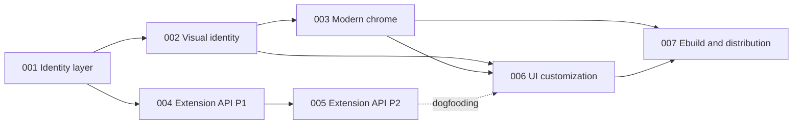

# ROADMAP — Zeo

> A rebrand of [Zed](https://github.com/zed-industries/zed) with a visual purpose: a
> beautiful, elegant, modern editor, with the ability to visually edit the UI and to
> build extensions that have control over the interface. The name references Power
> Rangers (Lord Zedd / the Zeo Crystal). No dates or deadlines — the schedule is ordered
> by dependency and value.

---

## 1. Vision and pillars

Zeo does **not replace** Zed — it expands and augments it visually, improving UI/UX.
It is a downloadable, installable editor, openly a rebrand, built on three pillars:

| Pillar | What | Technical path |
|---|---|---|
| **P1 — Identity** | An installable product with its own name, icon, channel, and state, coexisting with Zed | Shallow rebrand (a patch series over the packaged Zed) |
| **P2 — Modern aesthetics** | A "Cursor-level" first impression: theme, design tokens, polished chrome | Native GPUI patches (path B in ZEO.md §6) |
| **P3 — Visual extensibility** | WASM extensions with declarative control over UI (status bar, panels) + user-facing visual customization | Visual Extension API (path A in ZEO.md §5) |

**Cross-cutting principles** (apply to every phase):

- **Refresh cost is the real budget.** The base is the commit the ebuild packages, and it
  moves almost daily. Every decision prefers: append-only new code (new crates/dirs) >
  small hunks in stable regions > never renaming internal crates.
- **Dogfood the API.** Wherever the Visual Extension API reaches, Zeo's aesthetic
  features are born as first-party extensions — native patches only where the API cannot
  go (chrome).
- **Upstream-compatible design.** The API follows the declarative direction of RFC
  [#53403](https://github.com/zed-industries/zed/discussions/53403) and discussion
  #37270 — if the Zed team tackles the topic, our patches become an upstreaming
  prototype.
- **Security/supply chain:** build `--frozen` against upstream's `Cargo.lock`; no new
  dependency without justification; updater disabled; never push to upstream.

## 2. Method

Each phase is a **story in the epic framework** (`.epic/stories/NNN-*`), with `story.md`
(EARS requirements) + `design.md` + `tasks.md` and approval gates. This ROADMAP is the
map; the executable specification of each phase is born when its story is created — the
sections below record the context and the specifications already known that will feed
those stories.

**Every phase ships as patches.** A story's output is one or more numbered patches in
`zed-patches/patches/<PF>/`, applied by `app-editors/zeo`. Nothing here carries a branch
of Zed, and no story may introduce one.

Agreed order: **aesthetics first** (002-003 before 004-005), then the API with nothing
lost — its research is already done (ZEO.md §4-5).

---

## 3. Phases

### 001 — Identity layer `[to be re-specified]`

**Objective.** Everything that makes a build of Zed *be* Zeo: its own name, channel,
`app_id`, state directories, binary name, icon and URL scheme — as patches against the
packaged commit.

**Context.** This story was executed once, in the fork era, as five commits against Zed
snapshot `5f8a7413`. Those commits were lost when the fork repository was deleted on
2026-09-12. What was **not** lost is their specification:
[`REBRAND.md`](REBRAND.md) §1 documents all five, row by row, with the decision (D2, D3,
D4, D9, D10) behind each. Re-specifying is cheaper than rebasing a six-snapshot-old diff
would have been.

**Known specification** — the touch points are small and measured:

- `crates/paths/src/paths.rs` — `APP_NAME` `"Zed"` → `"Zeo"`. **One line**, and upstream
  invites it: *"Forks should change this to avoid colliding with Zed's user data."*
  `APP_NAME_LOWERCASE` is derived from it in a `const`, so `~/.config/zeo`,
  `~/.local/share/zeo`, cache, state and logs all follow. (D4)
- `crates/zed/Cargo.toml` — `default-run` and `[[bin]] name` → `zeo`. **Two lines**; the
  package and crate stay `zed`. (D9)
- `crates/release_channel/src/lib.rs` — a `ReleaseChannel::Zeo` variant. The enum has
  four today, and adding a fifth makes the compiler point at every exhaustive `match`
  that needs an arm, with file and line. Mechanical, not archaeology. (D2)
- auto-update neutralized and `remote_server` never fetching from zed.dev. (D3)
- desktop entry, icons and the `zeo://` scheme — the art is finished and lives in
  [`../brand/`](../brand/). Icon file name must equal `app_id` for Wayland to resolve the
  window icon. (D10)

**Hard boundaries.** Crate names stay `zed`; the WIT package `zed:extension` never
changes — it is the ABI every existing Zed extension imports.

**Key deliverable.** A Zeo that starts, identifies as itself, writes to its own state
directories, and coexists with an installed `app-editors/zed`.

---

### 002 — Visual identity (theme + design tokens) `[planned]`

**Objective.** The first "wow": opening Zeo and seeing an elegant, sophisticated editor
— the concrete translation of "visually close to Cursor, with a modern feel".

**Context.** In Zed, the **theme controls colors** (JSON → `ThemeRegistry`); **geometry
lives in code** (radius, spacing, shadows, density — `crates/ui`, `crates/theme`,
workspace chrome). So the identity has two halves: a default Zeo theme (data, ~zero
rebase cost) and a **design-token layer** patched into the core (code, centralized to
minimize conflicts). This is where GPUI plays in our favor: full rendering control,
without the CSS/Electron limitations Cursor itself has.

**Planned specifications:**

- **Visual spec before code**: moodboard/references (Cursor, GPUI apps such as
  Hummingbird/Fulgur), a written definition of what "modern" means — contrast, depth
  (shadows/elevation), corners, breathing room (spacing), typography, accents.
- **Tokens**: a single Zeo token module (radius scale, spacing scale, elevation, accent
  palette, opacities) consumed by the patched sites — never hardcoded values scattered
  around. Light/dark variants from the start.
- **Default Zeo theme**: a bundled theme JSON selected by default on the `zeo` channel
  (with the normal Zed themes as fallback — nothing is removed).
- **Final art**: definitive logo/icon replace the 001 placeholder (a Zeo Crystal
  reference is welcome); desktop entry/assets updated.
- **Screenshot-driven acceptance**: a before/after pair per surface (editor, tabs,
  status bar, panels) reviewed at the gate.

**Risks.** Theme JSON cannot reach geometry → everything code-side must go through the
tokens; "beautiful" is subjective → the visual spec approved at the design gate is the
arbiter.

---

### 003 — Modern chrome `[planned]`

**Objective.** Modernize the editor's structural surfaces, component by component, on
top of the 002 tokens.

**Context.** Zed's chrome (title bar, tab bar, status bar, docks, pickers, command
palette, modals) is minimal and dated — it is where the "made 10+ years ago" perception
lives. These are hot upstream files (`crates/workspace`, `crates/ui`, `crates/title_bar`
etc.): every patch must be small, isolated per component, and visually reviewable.

**Planned specifications:**

- Iteration **per component** (each is its own task/gate): title bar → tab bar → status
  bar → docks/panels → command palette/pickers → modals/toasts.
- Per-surface polish: radius/spacing from the tokens, hover/active states with
  transitions (GPUI animates natively), shadows/elevation on popovers and modals,
  typographic hierarchy, consistent icons.
- **No feature removal**: presentation only — Zed's shortcuts, layouts, and flows remain
  (the "expand, don't replace" principle).
- Each component delivers: an isolated patch + before/after screenshots + manual smoke.

**Risks.** The highest refresh friction of the roadmap (hot files) — mitigated by
minimal, per-component patches, each carrying its reasoning in its `format-patch` header
so a re-port starts from *why* rather than from the diff alone. An upstream refactor of a
patched component still forces that re-port; meanwhile `verify.sh` fails loudly and the
ebuild keeps naming the last series that applied.

---

### 004 — Visual Extension API, Phase 1: status bar `[planned]`

**Objective.** The first "wall socket": WASM extensions declare status bar items — data,
not UI code — and Zeo renders them natively. (~600-900 lines, low risk.)

**Context (full research in ZEO.md §4-5).** Zed's extension runtime (wasmtime +
versioned WIT) has ~80% of the plumbing: pluggable sub-proxies (`ExtensionHostProxy`),
main-thread hop (`WasmState::on_main_thread`), double-keyed capabilities (manifest
declares + user grants), and a real precedent (context servers already render
markdown/forms in GPUI). There is no spontaneous guest→host push ⇒ the API is
**host-driven** (click → export → extension responds).

**Planned specifications (ZEO.md §5 plan, Phase 1):**

- New WIT `since_v0.9.9/` (copy of 0.8.0 + `status-item.wit`: record
  `{icon, label, tooltip, color?}`, import `update-status-item(id, item)`, export
  `status-item-clicked(id)`) — version `0.9.9` avoids colliding with upstream's future
  0.9.0 (`PENDING_CHANGES.md`).
- Host mirror `since_v0_9_9.rs` + dispatch arm + `MAX_VERSION` bump + a 1-line patch to
  the Stable channel gate (`wit.rs:66`).
- `status_items` in the extension manifest + `ui:status_item` capability (existing
  mold, double-checked).
- `ExtensionStatusItemProxy` (new sub-proxy) + **new crate** `status_item_extension`
  (global store observed by one `StatusItemView` per window, implementing
  `hide_setting`/`HideStatusItem` from the start).
- **Example extension** (Zeo first-party) as a living acceptance criterion.

**Risks.** Upstream shipping its own 0.9.0 (mitigated by 0.9.9); the recent
`status_bar.rs` reform (implement against the new API from the start).

---

### 005 — Visual Extension API, Phase 2: declarative panel `[planned]`

**Objective.** Extensions declare dock panels with a UI tree as data
(tree/table/markdown/rows/buttons → `action-id`). (~1.5-2.5k lines, medium risk.)

**Context.** The JSON→GPUI renderer already exists as a production pattern: agent_ui/ACP
(`ToolCall`/`Plan` → `thread_view`) is the exact mental model. Ready-made components in
`crates/ui` (`data_table`, `list`, `tree_view_item`, `button`, `context_menu`) and the
`markdown` crate give rich text for free. Structural obstacle: the `Panel` trait has
*type-keyed* identity (`persistent_name()` without `&self`) — N dynamic panels have no
identity of their own.

**Planned specifications (ZEO.md §5 plan, Phase 2):**

- `[panels.<id>]` in the manifest (title, `IconName`, default dock) + `ui:panel`
  capability.
- Versioned UI JSON schema + **new crate** `extension_panel_ui` (renderer,
  ~500-1000 lines).
- Exports `panel-root(panel-id) -> ui-json` and `panel-action(panel-id, action-id)`;
  import `update-panel(panel-id, ui-json)`.
- **MVP: a single "Extension Panel" container** — sidesteps the `Panel` trait's static
  identity with zero patches to `dock.rs`; registered in `initialize_panels`
  (~5 lines).
- Security/robustness: WASM sandbox kept, predefined components (no arbitrary
  HTML/CSS), tree size/count limits, frame budget.
- Optional Phase 3 (recorded, no story of its own yet): per-instance dock identity
  (~50 lines + serialization), `text-input`, incremental refresh.

---

### 006 — User-facing visual customization `[planned]`

**Objective.** "Visually editing the UI": the user adjusts Zeo's appearance through live
configuration, without recompiling — the third pillar aimed at those who don't write
extensions.

**Context.** Depends on the tokens (002) and the chrome (003): customization requires
the values to be centralized. Wherever the API (004-005) reaches, parts of the
experience can be toggleable first-party extensions (dogfooding).

**Planned specifications:**

- `zeo` settings namespace in `~/.config/zeo/settings.json` (schema-validated):
  accent/palette, radius scale, density/spacing, chrome toggles (e.g. status bar
  elements via `HideStatusItem`, tab style), animation intensity.
- **Live application** (settings observers already exist in Zed — no restart).
- Editing surface: a visual settings page (GPUI) with preview; text editing keeps
  working (it is the native mechanism).
- Documentation for every knob and its default.

**Risks.** Combinatorial explosion of appearances → a curated, tested set of knobs
(each toggle with screenshots in both states); knobs must map 1:1 to tokens, never to
local hacks.

---

### 007 — Ebuild and distribution `[planned]`

**Objective.** `app-editors/zeo` in the bentoo overlay, and a prebuilt Zeo for people who
will not compile it.

**Context.** This converges with work already specified for the patched Zed — the
`zed-plus-bin` plan — because the two face the same problems: a binary that must run on
CPUs that are not the build host's, a provenance record, and a corresponding-source
obligation.

**Planned specifications:**

- **Ebuild.** `app-editors/zeo`, sharing `zed-patches`' series and selecting its own
  subset through `PATCHES+=()`. No file collision with `app-editors/zed`: the identity
  layer already separates the binary (`zeo` vs `zedit`) and the state directories, which
  is what makes coexistence work without a blocker. `metadata.xml`, clean `pkgcheck`,
  `~amd64`.
- **Prebuilt.** Built against a **generic `x86-64-v3`** baseline, never the build host's
  microarchitecture — a `-march=znver5` binary raises `SIGILL` on any CPU without
  AVX-512. A `pkg_pretend()` AVX2 check turns that silent crash into a clear message.
- **Provenance and licence.** Each release carries the packaged commit, the patch series
  with a sha256 per patch, the USE flags and the baseline; the corresponding source
  travels with the binary (GPL-3 §6). `RESTRICT` must **not** carry `bindist`, which
  would forbid the redistribution the release exists for.
- **Cadence.** On demand, with its own version suffix. A cold build takes hours because
  the generic flags miss nearly every `sccache` entry; promising to track the daily
  snapshot would break in the first busy week.

---
## 4. Beyond the horizon (no story)

- **Co-evolution with the ACP adapter** (the `claude-agent-plus` workspace): future
  agent panel improvements land as patches in the shared series, which is also how they
  reach the packaged Zed.
- **Upstreaming**: if RFC #53403 advances in Zed, propose Zeo's API (004-005) as a
  prototype — the declarative design was chosen for this.
- **API Phase 3** (per-instance panel identity, inputs, incremental refresh) — promoted
  to a story if Phase 2 creates real demand.
- **Binary distribution** (GitHub Releases) and a Zeo update channel — currently and
  explicitly out of scope (updater neutralized).

## 5. Status

| Story | Phase | State |
|---|---|---|
| 001 | Identity layer | **To be re-specified** — executed once in the fork era, lost with it; spec intact in REBRAND.md §1 |
| 002 | Visual identity | Nine commits exist as patches in `../archive/unpublished-commits/`, against snapshot `5f8a7413` — they need refreshing before adoption |
| 003 | Modern chrome | Planned |
| 004 | Extension API P1 (status bar) | Planned — research done (ZEO.md) |
| 005 | Extension API P2 (panel) | Planned — research done (ZEO.md) |
| 006 | UI customization | Planned |
| 007 | Ebuild and distribution | Planned — converges with the `zed-plus-bin` work |

**Nothing is installable yet.** The honest summary is that Zeo has a finished mark, a
complete specification, and no patch in the series.

> References: [ZEO.md](ZEO.md) (complete technical research) · [REBRAND.md](REBRAND.md)
> (the identity inventory, and the spec story 001 is rebuilt from) ·
> [`../archive/`](../archive/) (the first run, including both stories' original
> specifications).
